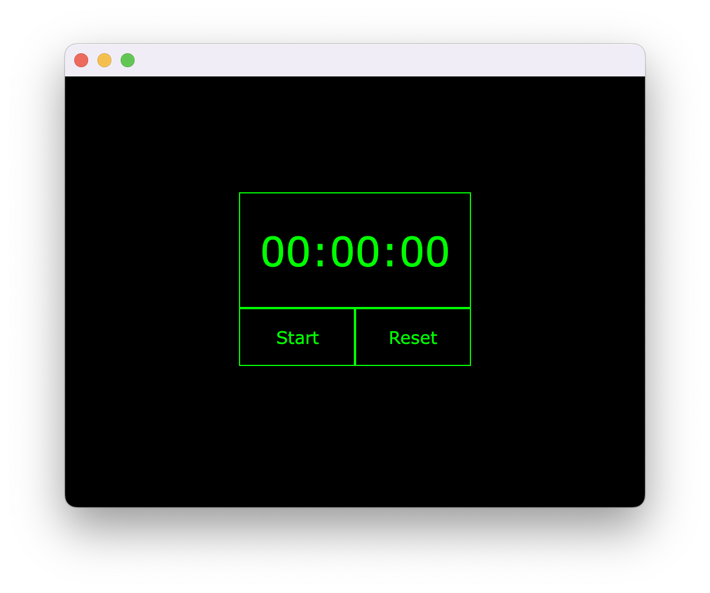
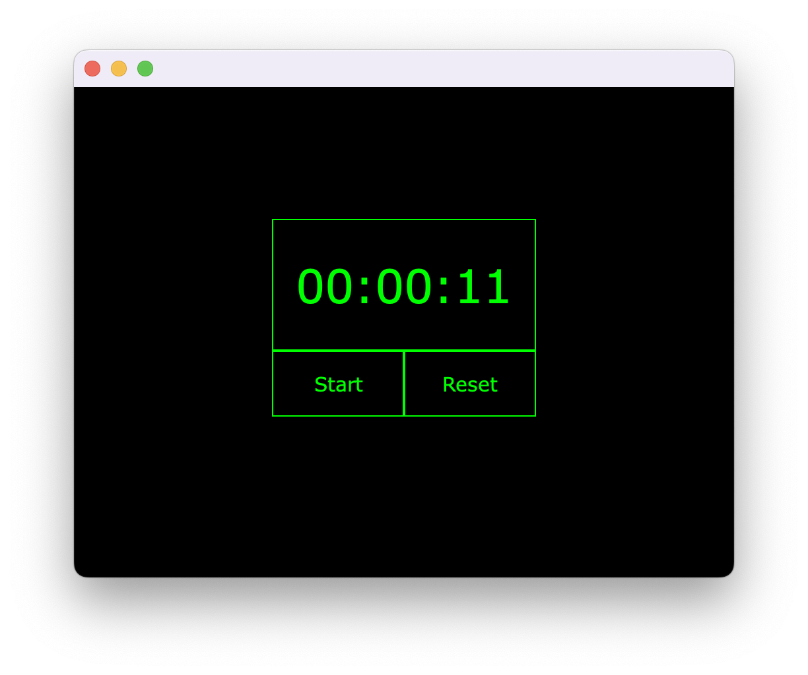
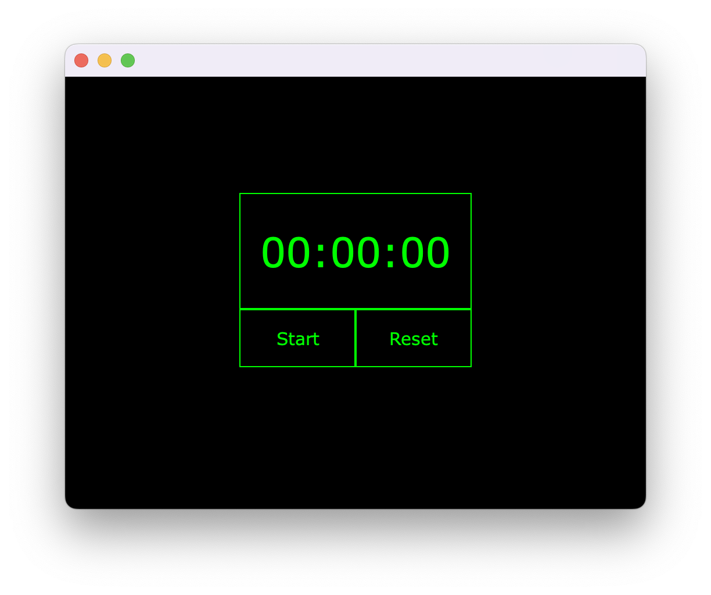

# Stopwatch with Java's GUI

The following is the code for a simple stopwatch that was done in winter 2021. This is a simple version of a stopwatch and was made to build more familiarity with java's GUI and it consists of two buttons; start/stop and reset. 

## How the stopwatch looks like:

### Stopwatch launch:

### Stopwatch start:

### Stopwatch stop:

### Stopwatch reset:

The reset button resets the time back to 0 (trivially), but it also resets the state of the start/stop button to start.

